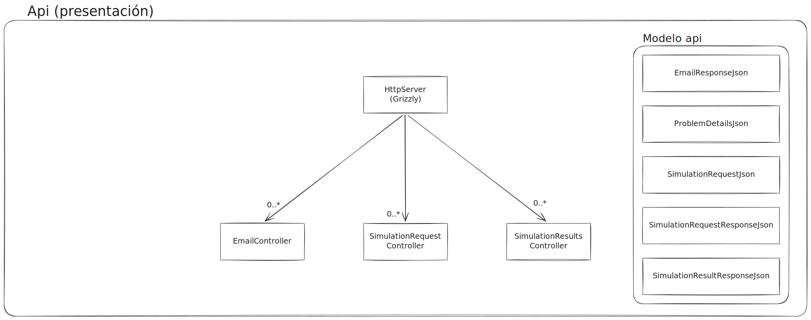
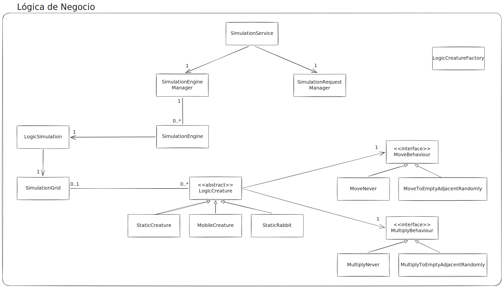
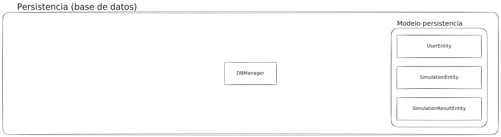
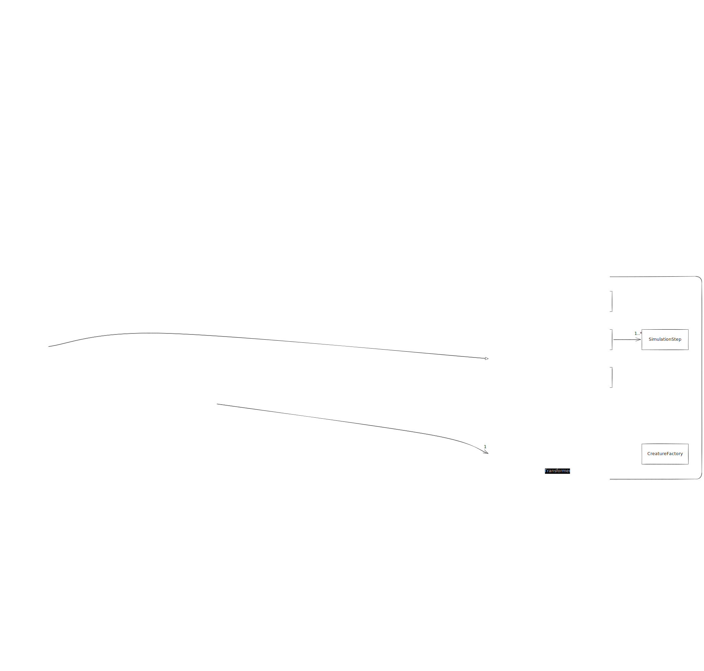

# Servidor de Simulaciones \- Trabajo en Grupo TT1

**Autores:** Juan Luis Medrano Miguel y Adrián Baldellou Aguirre.

[Informe del proyecto (Google Docs)](https://docs.google.com/document/d/12mSnx8gF6DMedae0g9ZdviFhDj2TXrpJABZuXUwqS_0/edit?usp=sharing)

[Documentación del proyecto (Javadoc)](https://adbaldel.github.io/TT1-Trabajo_en_grupo/)

## ¿De qué va este proyecto?

Este proyecto es un servidor backend (una API REST) creado en Java para la asignatura Taller Transversal I. Su objetivo principal es procesar simulaciones de criaturas en un tablero en segundo plano, gestionar el estado de estas simulaciones y permitir la consulta de resultados mediante un sistema de tokens.

### La Simulación

La lógica central consiste en un tablero bidimensional poblado por distintas entidades que interactúan por turnos (de izquierda a derecha y de arriba a abajo). Tenemos 3 tipos de criaturas definidas:

1. **Estáticas:** Se quedan quietas en su casilla.
2. **Móviles:** Se mueven a una casilla adyacente libre basándose en una probabilidad.
3. **Se multiplican:** No se mueven, pero pueden crear una cría clónica en una casilla libre adyacente con cierta probabilidad.

Para evitar que el servidor se bloquee, la ejecución es asíncrona: cuando el usuario pide una simulación, el servidor devuelve rápidamente un `token` identificador y arranca la simulación en un hilo paralelo.

## Metodología

El proyecto se está desarrollando siguiendo una metodología ágil basada en Kanban y aplicando TDD (Test-Driven Development).

## Endpoints de la API

El servidor expone y procesa peticiones en formato JSON (documentado bajo estándar OpenAPI) en las siguientes rutas:

### Gestión de Simulaciones

* `POST /Solicitud/Solicitar`: Crea una nueva simulación asociada a un `usuario`. Recibe un JSON con los nombres de criaturas y sus cantidades iniciales. Retorna un `token`.
* `GET /Solicitud/ComprobarSolicitud`: Consulta si una simulación en concreto sigue ejecutándose o ya ha terminado (usando el `nombre de usuario` y el `token`).
* `GET /Solicitud/GetSolicitudesUsuario`: Obtiene la lista de todos los `tokens` pertenecientes a un `usuario`.
* `GET /Solicitud/GetCriaturas`: Obtiene la lista de nombres de criaturas que el servidor sabe simular.

### Resultados

* `POST /Resultados`: Recupera el resultado completo de los pasos del tablero de una simulación finalizada (usando el `nombre de usuario` y el `token`). Retorna un JSON que contiene una cadena en formato CSV con los datos del resultado.

### Extra

* `POST /Email`: Endpoint para enviar correos electrónicos de notificación.

### OpenAPI

* `GET /openapi.json`: Obtiene la especificación OpenAPI de la API en formato `JSON`.
* `GET /openapi.yaml`: Obtiene la especificación OpenAPI de la API en formato `YAML`.
* `GET /swagger/index.html`: Obtiene una web interactiva ver la especificación de la API y probarla. Web proporcionada por Swagger UI.

## Configuración

El servidor es configurable a través del archivo `application.properties`. Las propiedades que se 
pueden configurar son:

### Servidor

* `server.base_uri`: La URI asociada al servidor.

### Simulación

* `simulation.ticks_to_run`: Los ticks a correr en cada simulación.
* `simulation.initial_occupancy`: El porcentaje del tablero que ocupan las criaturas en el paso inicial de simulación.
* `simulation.food_probability`: El porcentaje de casillas del tablero que reciben comida en cada tick.

### Criaturas

#### Criaturas estáticas

* `creature.static.names`: Los nombres de criaturas estáticas que conoce el servidor.
* `creature.static.colors`: Los colores asociados a dichas criaturas.
* `creature.static.starvation_thresholds`: El número de ticks que aguantan sin comer dichas criaturas.

#### Criaturas móviles

* `creature.mobile.names`: Los nombres de criaturas estáticas que conoce el servidor.
* `creature.mobile.colors`: Los colores asociados a dichas criaturas.
* `creature.mobile.starvation_thresholds`: El número de ticks que aguantan sin comer dichas criaturas.
* `creature.mobile.move_probabilities`: La probabilidad que tienen de moverse dichas criaturas.

#### Criaturas que se reproducen

* `creature.static_rabbit.names`: Los nombres de criaturas estáticas que conoce el servidor.
* `creature.static_rabbit.colors`: Los colores asociados a dichas criaturas.
* `creature.static_rabbit.starvation_thresholds`: El número de ticks que aguantan sin comer dichas criaturas.
* `creature.static_rabbit.multiply_probabilities`: La probabilidad que tienen de reproducirse dichas criaturas.

## Arquitectura

La aplicación sigue una arquitectura de capas estándar de Jakarta RESTful Web Services (JAX-RS):
* **Presentación / API (`com.tt1.simserver.api`):** Expone los endpoints HTTP. Mapea las rutas web a los controladores y estandariza las respuestas.
  
* **Lógica de Negocio (`com.tt1.simserver.logic`):** El cerebro del servidor. Contiene el motor de simulación, la gestión asíncrona de hilos y las reglas de negocio.
  
* **Persistencia (`com.tt1.simserver.database`):** Capa encargada de guardar los resultados de simulaciones.
  
* **Modelo de Dominio (`com.tt1.simserver.model`):** Clases que definen los conceptos que se usan en la aplicación (Simulación, Criatura, Usuario, ...).

### Diagrama conceptual



## Tecnologías y Dependencias

* **Lenguaje:** Java 21
* **Framework Web:** JAX-RS (Jersey) \+ Grizzly (Servidor HTTP embebido para poder ejecutar desde un `main()` sin necesidad de Tomcat o equivalente).
* **Serialización:** Jackson (`jersey-media-json-jackson`) para pasar de objetos Java a JSON y viceversa.
* **Framework Persistencia:** JPA (Hibernate) \+ MySQL.
* **Testing:** JUnit 6 (Jupiter)
* **Construcción:** Maven (`maven-shade-plugin` para crear un ejecutable *uber-jar* autocontenido).

## Cómo ejecutar

Sitúate en la raíz del proyecto y compílalo usando Maven:
```bash
mvn clean package
```

Esto generará un archivo `.jar` ejecutable en la carpeta `target/`. Para arrancar el servidor, ejecuta:
```bash
java -jar target/simserver-1.0-SNAPSHOT.jar
```

### Docker

En vez de ejecutar el `.jar` directamente, se puede crear una imagen de docker con el `Dockerfile` del proyecto:
```bash
docker image build -t tt1/simserver .
```

Después para arrancar el servidor con el puerto 8081 publicado, conectado a un contenedor con una base de datos 
MySQL 8, solo haría falta usar el `docker-compose.yml` proporcionado:
```bash
docker-compose up
```

#### Combinación con el trabajo individual

Si además tienes la imágen de docker `simwebapp` (imagen que corre el `.jar` del trabajo individual del proyecto), 
puedes levantar la `simwebapp` (trabajo individual) con el puerto 8080 publicado, conectada al `simwebserver` que a 
su vez está conectado a un MySQL 8. Para ello solo haría falta usar el `docker-compose_with-simwebapp.yml` proporcionado:
```bash
docker-compose -f docker-compose_with-simwebapp.yml up
```